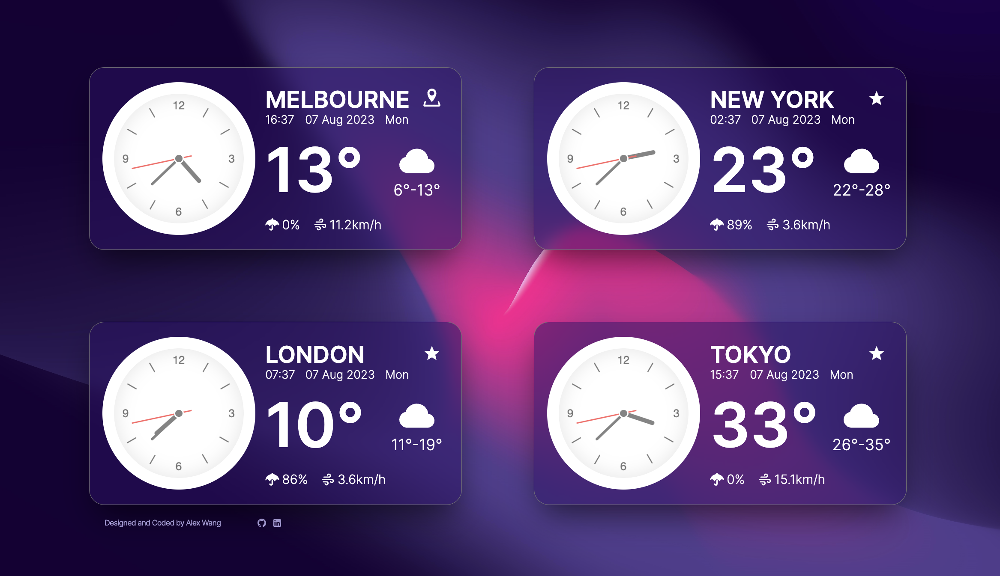
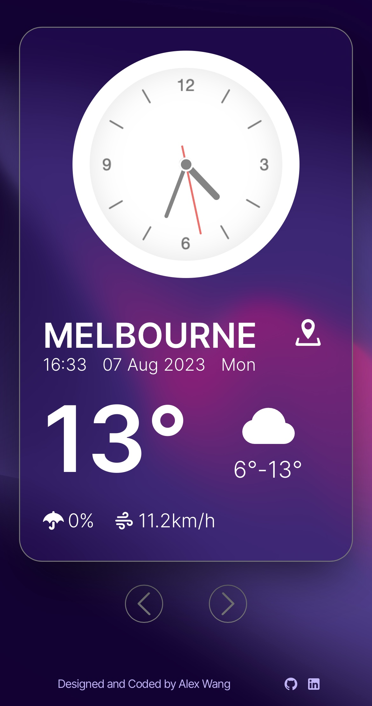

# Clock & Weather App

## Project Description

This application, built with [Next.js](https://nextjs.org/), provides real-time clock and weather data for four different cities around the world. The time and weather information is fetched from an API, providing the user with up-to-the-minute updates.

### UI Overview

Here's a glimpse of the Clock & Weather App, highlighting its features and aesthetics.

### Desktop View

*Desktop version of the Clock & Weather App*

### Mobile View

*Mobile version of the Clock & Weather App*

## Technical Stack

This application utilizes several modern web technologies, including:

- **Next.js**: The core framework used to build this server-rendered React application.
- **React (with Hooks)**: Used for building the user interface and handling component state and side effects.
- **Styled Components**: Utilized for writing CSS in JavaScript, allowing for more dynamic and reusable components.
- **SWR**: Used for efficient, fast, and lightweight data fetching.
- **Axios**: Promised-based HTTP client for making API calls.
- **Moment.js & Moment Timezone**: Used for parsing, validating, manipulating, and displaying dates and times in JavaScript, in any timezone.
- **Tailwind CSS**: A utility-first CSS framework used for rapidly building custom user interfaces.
- **Headless UI**: A completely unstyled, fully accessible UI component library, designed to integrate beautifully with Tailwind CSS.
- **@iconify/react**: An icons library that includes popular icon sets that can be used easily in React.
- **PostCSS and Autoprefixer**: Tools for transforming CSS with JavaScript, and for adding vendor prefixes to CSS rules.

## Upcoming Features

- **Automatic Location Detection**: The app will soon be able to automatically detect the user's location.
- **Custom City Selection**: Users will have the ability to manually select cities of their choice.
- **User Creation and Login**: In development to enable personalized settings for individual users.
- **Personalized Data Storage**: For storing and retrieving user-specific data and preferences.

## Installation and Running

Follow the steps below to set up and run this project on your local environment:

### Install Dependencies
Using npm or yarn, install the project's dependencies:

```bash
npm install
# or
yarn
```
### Run the Project
Once the dependencies are installed, you can run the project using Vite:

```bash
npm run dev
# or
yarn dev
```
The application will start and by default can be accessed at http://localhost:3000.

## How to Contribute

Contributions to this project are always welcome. Here's how you can help enhance its features or make improvements:

### Fork the Repository

Start by forking the project repository, then clone your fork using:
```bash
git clone https://github.com/MarkLumenAW/clock-weather.git
```

### Create a New Branch

It's recommended to create a new branch for each feature or fix:

```bash
git checkout -b name-of-your-new-branch
```
### Make Your Changes

Implement your desired modifications or additions to the code.
  
### Commit Your Changes

Once done, save your changes:

```bash
git commit -m "Provide a brief description of your changes here"
```
### Push to Your Branch

Push your updates to your branch:

```bash
git push origin name-of-your-new-branch
```
### Open a Pull Request

Navigate to the original project repository on GitHub and submit a pull request. Ensure you give a detailed explanation of the changes you've made.

Your contribution will be reviewed, and if it meets the project's standards and objectives, it'll be merged. Thanks in advance for your effort and input!

## Contact Me

If you have questions or wish to discuss the project further, don't hesitate to reach out:

- **Email:** [wangpengchengnj@gmail.com](mailto:wangpengchengnj@gmail.com)
- **Personal Website:** [www.alexwang.studio](https://www.alexwang.studio)

I'm always open to feedback, collaboration, or general inquiries. Looking forward to hearing from you!

